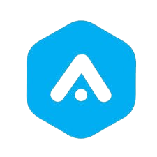
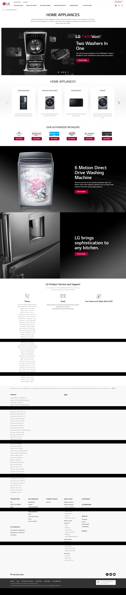

  

# (LG Website) Project for Rework Academy Admission

## You are to clone the LG website with the resources given to you. View and download the resources on your dashboard and extract the zip folder and you will find all the images you need.

## You are to create three pages:
1. Index Page 
2. Home Appliances page 
3. TV-Audio Page

The images for all pages are in their respective folder names. Index page image is found in index page folder, home appliances page images are in home appliances page folder and tv-audio page images are in tv-audio page folder.

There are screenshots of the pages you are to design in the individual folders. The image is called screenshot. Open the screenshot image on your system and see a view of the page you are to design.

To make it easier for you, the names of the images are similiar to how they appear in the website. You can know a particular image by its name.

Note:
Images that have .svg extensions can still be used as noraml images. 
example: 

# Expected Result: 

